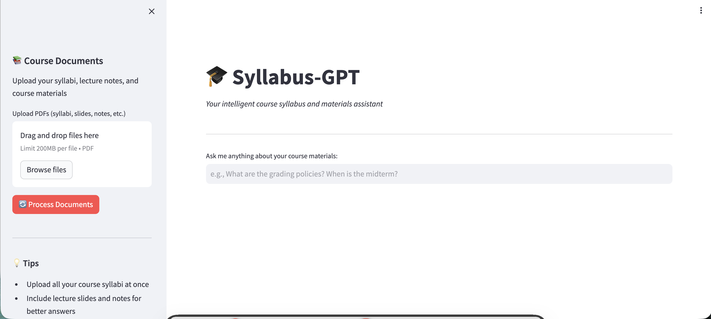

# 🚀 Deployment & Demo Guide

This guide shows you **three ways** to run Syllabus-GPT and create demo screenshots.

---

## Method 1: Google Colab (Easiest - No Installation!) ⭐

**Best for:** Quick demo, no local setup needed

### Steps:

1. **Upload the Colab Notebook**
   - Go to https://colab.research.google.com/
   - Click "File" → "Upload notebook"
   - Upload `Syllabus_GPT_Colab.ipynb`

2. **Get Required Keys**
   - **OpenAI API Key**: https://platform.openai.com/api-keys
   - **ngrok Auth Token**: https://dashboard.ngrok.com/get-started/your-authtoken (free signup)

3. **Run All Cells**
   - Click "Runtime" → "Run all"
   - Enter your API keys when prompted
   - Wait for ngrok URL to appear

4. **Access Syllabus-GPT**
   - Click the ngrok URL (looks like: `https://xxxx-xx-xxx-xxx-xx.ngrok-free.app`)
   - Your app is now live!

5. **Create Demo**
   - Upload `examples/sample_syllabi/CS301_AI_Syllabus.pdf`
   - Ask questions
   - Take screenshots

### ⚠️ Limitations:
- Runs on free Colab tier (can be slow)
- Session expires after inactivity
- ngrok free tier has connection limits

---

## Method 2: Streamlit Community Cloud (Best for Sharing!) 🌟

**Best for:** Public demo, sharing with others, portfolio

### Steps:

1. **Push to GitHub First**
   ```bash
   git clone https://github.com/AIdoAI/syllabus-gpt.git
   cd syllabus-gpt
   # Make any changes
   git add .
   git commit -m "Ready for deployment"
   git push origin main
   ```

2. **Deploy to Streamlit Cloud**
   - Go to https://share.streamlit.io/
   - Click "New app"
   - Select your repository: `AIdoAI/syllabus-gpt`
   - Main file path: `app.py`
   - Click "Deploy"

3. **Add Secrets (CRITICAL!)**
   - In Streamlit Cloud dashboard, click "⚙️ Settings"
   - Go to "Secrets" section
   - Add:
     ```toml
     OPENAI_API_KEY = "your_openai_api_key_here"
     ```
   - Click "Save"

4. **Wait for Deployment**
   - Takes 2-5 minutes
   - You'll get a public URL like: `https://aidoai-syllabus-gpt.streamlit.app`

5. **Create Demo**
   - Visit your public URL
   - Upload sample syllabus
   - Take screenshots
   - Share the URL on LinkedIn/Resume!

### ✅ Advantages:
- **Free permanent hosting**
- Professional public URL
- Easy to share
- No local setup needed
- Auto-restarts on code changes

### 📝 Important Notes:
- Keep your API key in Streamlit Secrets (never in code!)
- Free tier has usage limits
- App goes to sleep after inactivity (wakes up when visited)

---

## Method 3: Run Locally (Best Performance) 💻

**Best for:** Development, fastest performance, full control

### macOS/Linux Steps:

```bash
# 1. Clone repository
git clone https://github.com/AIdoAI/syllabus-gpt.git
cd syllabus-gpt

# 2. Create virtual environment
python3 -m venv venv
source venv/bin/activate

# 3. Install dependencies
pip install -r requirements.txt

# 4. Set up API key
echo "OPENAI_API_KEY=your_key_here" > .env

# 5. Run the app
streamlit run app.py
```

### Windows Steps:

```bash
# 1. Clone repository
git clone https://github.com/AIdoAI/syllabus-gpt.git
cd syllabus-gpt

# 2. Create virtual environment
python -m venv venv
venv\Scripts\activate

# 3. Install dependencies
pip install -r requirements.txt

# 4. Set up API key
echo OPENAI_API_KEY=your_key_here > .env

# 5. Run the app
streamlit run app.py
```

### What Happens:
- App opens in your browser at `http://localhost:8501`
- Fastest performance
- Full control over everything

### ✅ Advantages:
- Fastest response times
- No connection limits
- Work offline (after initial setup)
- Best for development

---

## 📸 Creating Your Demo Screenshot

### What to Capture:

**Essential Elements:**
1. ✅ Syllabus-GPT header
2. ✅ A question in the input box
3. ✅ The AI's answer
4. ✅ **SOURCE CITATIONS** (this is your key feature!)
5. ✅ Sidebar showing uploaded documents

### Recommended Question/Answer to Screenshot:

**Question:** "What is the grading breakdown for this course?"

**Expected Answer:**
```
The grading breakdown is:
- Homework Assignments: 30%
- Midterm Exam: 25%
- Final Project: 30%
- Class Participation: 10%
- Quizzes: 5%

Sources:
📄 CS301_AI_Syllabus.pdf (p. 1)
```

### Screenshot Tools:

**Mac:**
- Press `Cmd + Shift + 4`
- Drag to select area
- File saves to Desktop

**Windows:**
- Press `Windows + Shift + S`
- Select area
- Paste and save

**Chrome Extension (Any OS):**
- Awesome Screenshot
- Fireshot

### Tips for Great Screenshots:

1. **Full width** - Show entire interface
2. **Clean browser** - Close unnecessary tabs
3. **Highlight citations** - This is your unique feature!
4. **Good contrast** - Make sure text is readable
5. **Professional** - Clean, uncluttered

---

## 🎬 Bonus: Create an Animated GIF

Even better than a screenshot!

### Tools:
- **Mac**: Kap (free) - https://getkap.co/
- **Windows**: ScreenToGif (free)
- **Online**: Loom → export as GIF

### What to Record:
1. Upload PDF (2 seconds)
2. Click "Process Documents" (2 seconds)
3. Type question (2 seconds)
4. Show answer with citations (3 seconds)

**Total:** ~10 second loop showing the full workflow

---

## 📊 Comparison Table

| Method | Difficulty | Speed | Best For | Cost |
|--------|-----------|-------|----------|------|
| **Colab** | ⭐ Easy | 🐌 Slow | Quick demo | Free |
| **Streamlit Cloud** | ⭐⭐ Medium | 🏃 Medium | Public sharing | Free |
| **Local** | ⭐⭐⭐ Advanced | 🚀 Fast | Development | Free |

---

## 🎯 Recommended Workflow

1. **First Time:** Use Colab for quick demo screenshot
2. **For Portfolio:** Deploy to Streamlit Cloud for permanent public URL
3. **For Development:** Run locally when making changes

---

## 🆘 Troubleshooting

### Colab Issues

**"ngrok tunnel failed"**
- Check your ngrok auth token is correct
- Get new token: https://dashboard.ngrok.com/get-started/your-authtoken

**"OpenAI API error"**
- Verify your API key is correct
- Check you have credits: https://platform.openai.com/usage

### Streamlit Cloud Issues

**"Module not found"**
- Make sure `requirements.txt` is in your repo
- Check all packages are listed

**"App crashed"**
- Check Streamlit Cloud logs
- Verify your OpenAI key is in Secrets (not .env)

### Local Issues

**"Streamlit command not found"**
- Make sure virtual environment is activated
- Reinstall: `pip install streamlit`

**"Port already in use"**
- Kill existing process or use different port:
  ```bash
  streamlit run app.py --server.port 8502
  ```

---

## 📝 After Creating Demo

### Add to GitHub:

```bash
# Add screenshot
git add demo.png
git commit -m "Add demo screenshot"
git push origin main
```

### Update README:

Replace the demo section with:
```markdown
## 📸 Demo



*Live demo available at: [your-streamlit-url]*
```

### Share on LinkedIn:

```
🎓 Excited to share my latest project: Syllabus-GPT!

An AI-powered course assistant that helps students find information 
in their syllabi with automatic source citations.

Key features:
✅ Natural language questions
✅ Instant answers from course materials  
✅ Automatic page citations
✅ Built with LangChain, OpenAI, and Streamlit

Try it: [your-streamlit-url]
Code: github.com/AIdoAI/syllabus-gpt

#AI #MachineLearning #Python #OpenAI #StudentTools
```

---

## ✅ Quick Start Recommendation

**If you just want a demo screenshot RIGHT NOW:**

1. Open Colab: https://colab.research.google.com/
2. Upload `Syllabus_GPT_Colab.ipynb`
3. Run all cells
4. Get your OpenAI key: https://platform.openai.com/api-keys
5. Get ngrok token: https://dashboard.ngrok.com/ (free signup)
6. Enter keys when prompted
7. Click the ngrok URL
8. Upload sample syllabus
9. Ask "What is the grading breakdown?"
10. Screenshot the answer with citations!

**Total time:** ~10 minutes

---

Need help? Open an issue on GitHub or check SETUP.md for more details!
